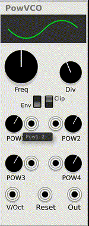
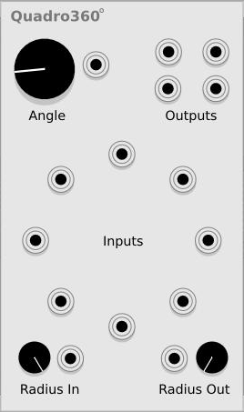

# Fruitsofkarma Modules

Some VCVRack modules

## PowVCO

Oscillator with envelope generator option

Each of four subperiods of the waveform is generated using y = x^n and you can control n for each subperiod.
In the envelope (Env) mode, the reset input works as trigger input.

## Quadro360

Quadro mixer with 8 inputs with rotation option

Imagine a square with 4 outputs at the corners and 8 inputs located around the center of the square, the output level is calculated as the distance between each input and output.

Parameters:
- Angle: Angle of rotation of inputs around the center
- Radius In: radius of the input circle
- Radius Out: radius of the output circle

## BrokenGlass

Particle visualiser

Parameters:
- Amount: amount of particles
- Rotate: angle of rotation for particles + additional randomness parameter
- Edges: number of edges + additional randomness parameter
- Opacity: particle opacity + additional randomness parameter
- Distort: distortion + another type of distortion
- Stroke: stroke width + additional randomness parameter
- Radius: radious of particle + additional randomness parameter
- Rotate all: angle of rotation around center
- Rot. speed: speed of rotation around center
- X, Y - Center coordinates
- Speed - speed of particles
- Red, Green, Blue: shift color components
