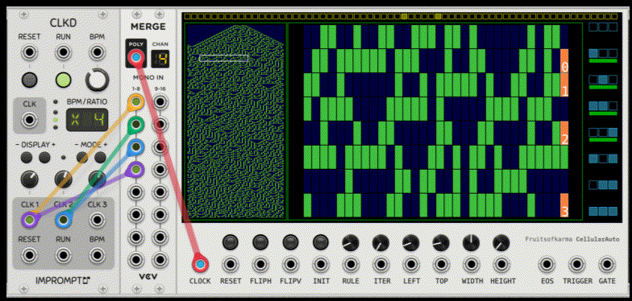
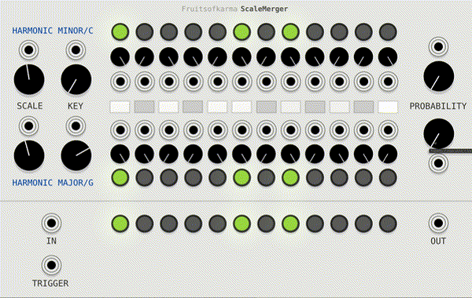
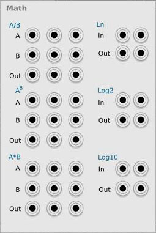

# Fruitsofkarma Modules

Some VCVRack modules

## CellularAuto

The 1024x16 Sequencer has a zoom window and pattern generator based on cellular automata algorithms.

Controls:
- Initial State (Top Bar): Set cells on the top bar. The last cell has 3 states; white means only 63 cells will be used to generate the pattern. Usefull for the Rule 90. The initial state can be cleared with the popup menu.
- Rule: Pick a cellular automaton rule (0-255). The chosen rule is shown on the right side of the display.
- Iter: Set the iteration count to generate pattern below 256 rows.
- Left, Top, Width, Height: Control the active zone size and position in the overall view on the left side of the display.
- Reset Button and Input: Reset all sequences.
- FlipH, FlipV Buttons and Inputs: Flip pattern horizontally or vertically.
- Init: Create a pattern based on initial state, Rule, and Iter settings.
- Clock Input: Connect to external modules for synchronization.

Outputs:
- EOS: End of sequence trigger output.
- Trigger Output: Trigger signal output.
- Gate Output: Gate signal output.

Polyphony:
Polyphonic clock input splits the sequencer into multiple channels. For example, a 16x8 active zone with a single input gives a 1x128 sequencer. Connecting 8 channels creates exactly 16x8 sequencer configuration.

## ScaleMerger

Probability quantizer with two scales with option to transit between one to another via their common pitches.

- Use the small knobs to adjust the chance of each individual pitch in the selected scale.
- The large probability knobs control the chance of unique pitches in the selected scale.
- To switch between scales, turn both large probability knobs all the way down. This will give you only the common pitches in the new scale. Rotating a large probability knob will activate only pitches from the related scale, but won't change the result scale while the related knob is set to 0.

Demo: https://youtu.be/9zSbBmtnPxM

## PowVCO

Oscillator with envelope generator option

Each of four subperiods of the waveform is generated using y = x^n and you can control n for each subperiod.
In the envelope (Env) mode, the reset input works as trigger input.

## Quadro360

Quadro mixer with 8 inputs with rotation option

Imagine a square with 4 outputs at the corners and 8 inputs located around the center of the square, the output level is calculated as the distance between each input and output.

Parameters:
- Angle: Angle of rotation of inputs around the center
- Radius In: radius of the input circle
- Radius Out: radius of the output circle

## Math

Set of basic math operations
You have 3 div operators, 3 mul operators, 3 pow operators and two ln, log2 and log10 functions.

## BrokenGlass

Particle visualiser

Parameters:
- Amount: amount of particles
- Rotate: angle of rotation for particles + additional randomness parameter
- Edges: number of edges + additional randomness parameter
- Opacity: particle opacity + additional randomness parameter
- Distort: distortion + another type of distortion
- Stroke: stroke width + additional randomness parameter
- Radius: radious of particle + additional randomness parameter
- Rotate all: angle of rotation around center
- Rot. speed: speed of rotation around center
- X, Y - Center coordinates
- Speed - speed of particles
- Red, Green, Blue: shift color components
